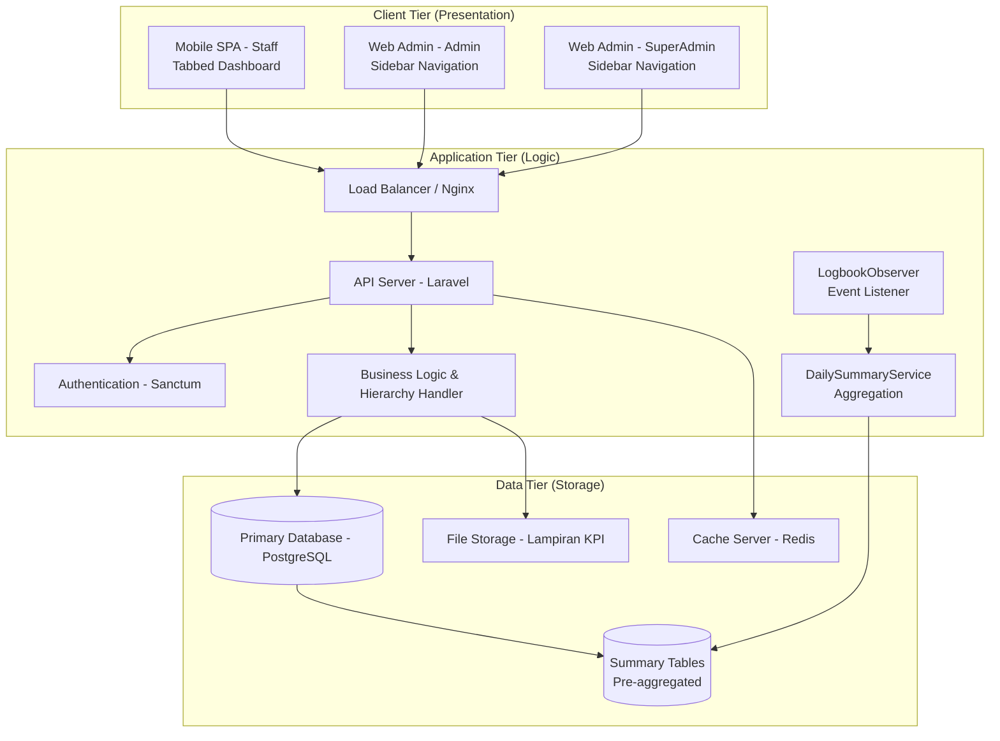
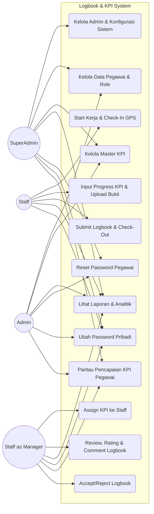
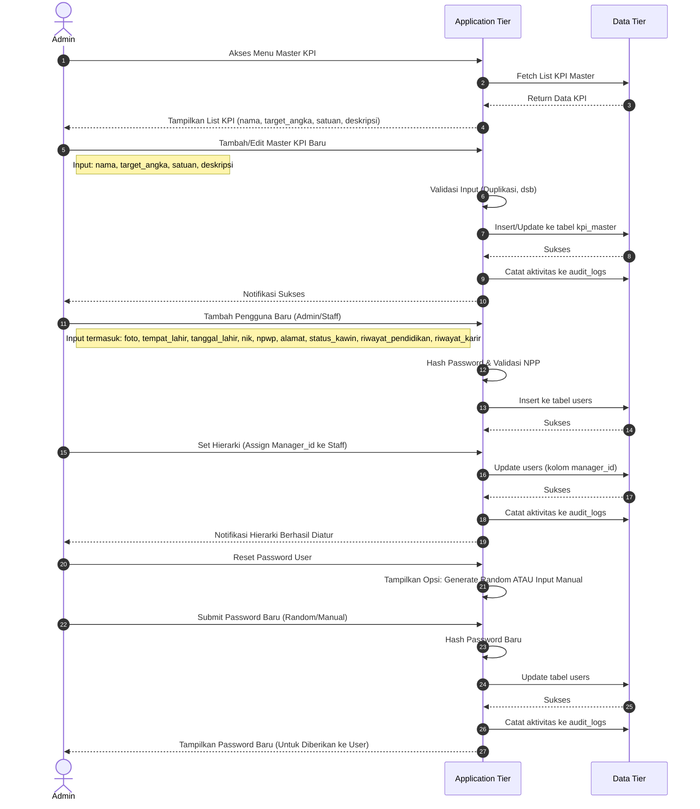
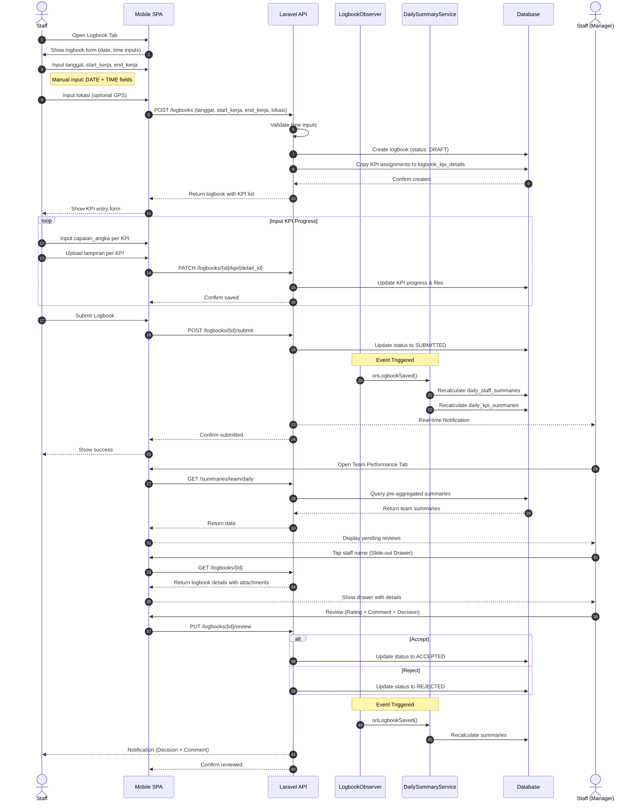
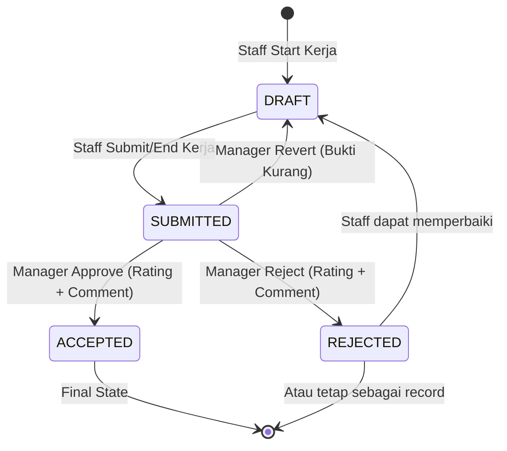
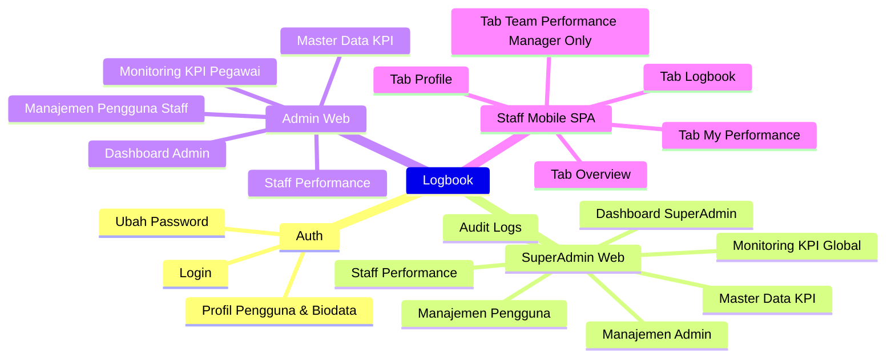
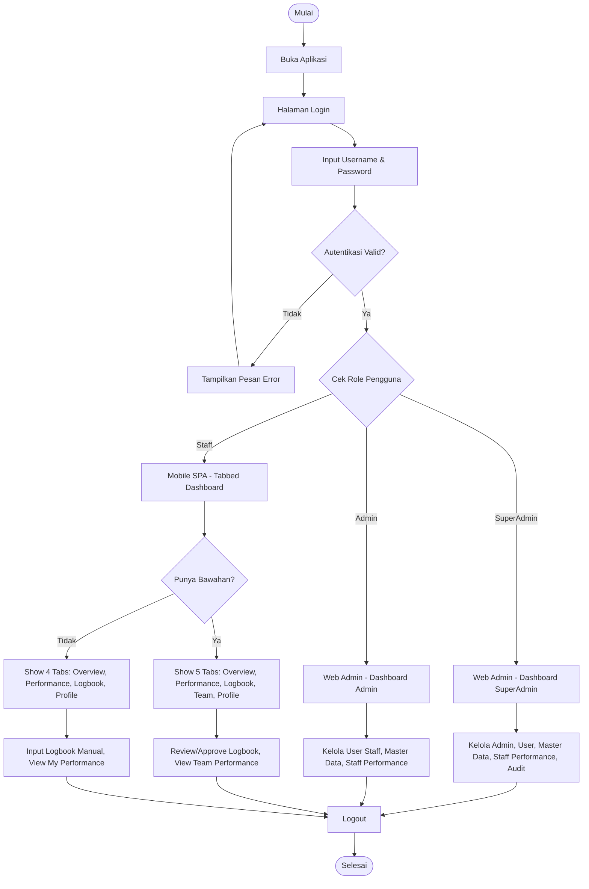
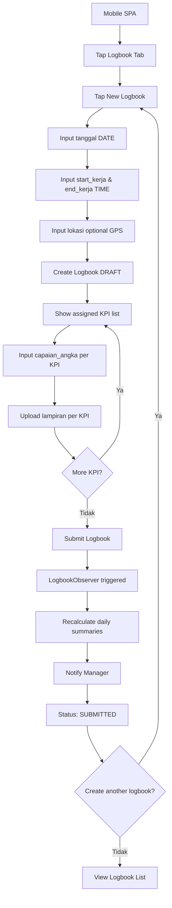

# SYSTEM DESIGN DOCUMENT: Aplikasi Manajemen Logbook & KPI Pegawai

## 1. Pendahuluan

Aplikasi ini dirancang untuk mendigitalisasi pelaporan kerja harian (Logbook) dan manajemen Key Performance Indicator (KPI) atau tugas karyawan. Sistem ini memastikan transparansi tugas yang diberikan oleh manajer, memfasilitasi pencatatan waktu dan lokasi, serta mengelola siklus hidup data untuk keperluan audit dan penilaian kinerja yang akurat.

**Improvements:**

- Mengadopsi arsitektur terukur dengan **Caching** dan **Asynchronous Processing**.
- Mendukung fitur offline-first melalui arsitektur PWA (Progressive Web App).
- Menambahkan kapabilitas Notifikasi dan Audit Logging yang komprehensif.
- **KPI Progress Tracking** menggunakan input numerik (capaian_angka) untuk pencatatan kemajuan yang lebih granular.
- **Break Time Auto-Calculation** menggunakan Database View dengan deteksi overlap jam istirahat (12:00-13:00).
- **Extended User Biodata** untuk keperluan HR dan compliance.
- **Manual Time Input** - Staff manual input `tanggal` (DATE), `start_kerja` (TIME), `end_kerja` (TIME).
- **Multiple Logbooks Per Day** - Staff dapat membuat multiple logbook entries dalam satu hari.
- **Pre-aggregated Summary Tables** - `daily_staff_summaries` dan `daily_kpi_summaries` untuk performance views yang cepat.
- **Event-Driven Updates** - Laravel LogbookObserver untuk auto-recalculation summaries.
- **Slide-out Drawer Pattern** - Detail drill-down menggunakan slide-out drawer.

---

## 2. Arsitektur Sistem

Arsitektur dibagi menjadi 3 tier utama (Client, Application, dan Data Tier) untuk memastikan skalabilitas, keamanan data, dan pemisahan logika (separation of concerns).



### Platform Distribution

| Platform | User Type | Technology | Navigation |
|----------|-----------|------------|------------|
| **Web Admin Panel** | SuperAdmin, Admin | SvelteKit + Laravel API | Sidebar |
| **Mobile SPA** | Staff (Pegawai) | SvelteKit PWA + Laravel API | Tabbed Dashboard |

---

## 3. Aktor & Hak Akses (Role-Based Access Control)

### Role Enum Definition

Sistem menggunakan 3 role utama: **SuperAdmin**, **Admin**, dan **Staff**.

> **Catatan Penting:** Role "Manager" tidak didefinisikan sebagai enum terpisah. Status manager ditentukan oleh relasi `manager_id` pada tabel users. Seorang Staff yang memiliki bawahan (ada users lain dengan `manager_id` menunjuk ke dirinya) secara otomatis memiliki kapabilitas manager.

### Role Hierarchy & Capabilities

```
┌─────────────────────────────────────────────────────────────┐
│                      ROLE HIERARCHY                          │
├─────────────────────────────────────────────────────────────┤
│  SuperAdmin                                                  │
│  ├── Can create Admin accounts                              │
│  ├── All Admin capabilities                                 │
│  ├── Audit logs access                                      │
│  └── System-wide configuration                              │
├─────────────────────────────────────────────────────────────┤
│  Admin                                                       │
│  ├── Can ONLY create Staff accounts (NOT Admin)             │
│  ├── Assign subordinates/managers (manager_id)              │
│  ├── Assign KPIs to staff                                   │
│  ├── View Staff Performance (all staff)                     │
│  ├── Master data management (KPI)                           │
│  └── Reports & Export                                       │
├─────────────────────────────────────────────────────────────┤
│  Staff                                                       │
│  ├── Uses Mobile SPA (tabbed dashboard)                     │
│  ├── Manual logbook input (tanggal, start_kerja, end_kerja) │
│  ├── Multiple logbooks per day allowed                      │
│  ├── View own performance via summary tables                │
│  └── +Manager capabilities if has subordinates              │
│       ├── View Team Performance tab                         │
│       ├── Review subordinates' logbooks                     │
│       └── Accept/Reject logbooks                            │
└─────────────────────────────────────────────────────────────┘
```

1. **SuperAdmin**: Mengelola seluruh konfigurasi sistem, termasuk manajemen Admin dan akses penuh ke semua data.
2. **Admin**: Mengelola master data (Pegawai, Master KPI). Dapat melihat semua data operasional untuk keperluan reporting. **TIDAK BISA** membuat akun Admin baru.
3. **Staff**: Pengguna akhir operasional via **Mobile SPA**. Input manual tanggal & waktu kerja, multiple logbooks per hari, input progress KPI, upload bukti per-KPI.
   - **Staff dengan Bawahan (Manager Capability)**: Staff yang memiliki `manager_id` pointing ke dirinya mendapat akses ke **Team Performance** tab, dapat mereview logbook bawahan, dan memberikan rating/komentar.

### Use Case Diagram



---

## 4. Fitur Utama & Alur Kerja (Core Workflows)

### A. Alur Pengelolaan Master Data & Hierarki (Admin/SuperAdmin)



### B. Alur Penugasan KPI (Manager Capability)

1. Admin/SuperAdmin membuat daftar "Master KPI" (Kamus Tugas) dengan `target_angka`, `satuan`, dan `deskripsi`.
2. Staff dengan kapabilitas Manager membuka profil Staff bawahannya, lalu menetapkan (assign) satu atau lebih KPI dari Master KPI.
3. Daftar tugas ini menjadi status "Aktif" untuk Staff tersebut dan akan disalin secara otomatis setiap kali Staff memulai logbook.

### C. Alur Logbook Harian (Staff & Manager)

> **PENTING (Revisi):** Staff sekarang menggunakan **Manual Time Input** dengan field `tanggal` (DATE), `start_kerja` (TIME), dan `end_kerja` (TIME). Staff dapat membuat **multiple logbooks per hari**. Semua akses melalui **Mobile SPA** dengan tabbed dashboard.



---

## 5. Logbook State Machine (Siklus Hidup Logbook)

Untuk mencegah perubahan data yang tidak sah dan menangani alur approval yang jelas, Logbook menggunakan sistem _State Machine_ dengan 4 status:



### Status Descriptions:

- **`DRAFT` (Sedang Berjalan)**
  - **Pemicu:** Terbentuk saat Staff klik "Start Kerja" (check-in >= 07:00).
  - **Akses:** Staff dapat mengedit (input capaian_angka, upload lampiran per KPI). Manager hanya bisa melihat status "Sedang Bekerja".
  - **Validasi:** Start time tidak boleh sebelum 07:00.

- **`SUBMITTED` (Menunggu Review)**
  - **Pemicu:** Berubah saat Staff klik "End Kerja" atau Submit Logbook.
  - **Akses:** Data **terkunci (Locked)** untuk Staff. Manager dapat mereview bukti, progress KPI, dan durasi kerja (auto-calculated).
  - **Opsi:** Manager dapat menekan "Revert" untuk mengembalikan ke `DRAFT` jika bukti kurang.

- **`ACCEPTED` (Disetujui)**
  - **Pemicu:** Berubah saat Manager memberikan approval dengan Rating (1-5) dan reviewer_comment.
  - **Akses:** Data **terkunci permanen**. Menjadi data historis valid untuk perhitungan kinerja.

- **`REJECTED` (Ditolak)**
  - **Pemicu:** Berubah saat Manager menolak logbook dengan Rating dan reviewer_comment.
  - **Akses:** Staff dapat memperbaiki dan re-submit, atau logbook tetap sebagai record penolakan.

---

## 6. Desain Basis Data (DBML & Schema)

Desain sistem memanfaatkan PostgreSQL. Untuk menjaga integritas data historis (Audit Trail), sistem mengimplementasikan **Soft Deletes**. Desain skema ini telah ditingkatkan dengan:
- Extended user biodata
- KPI progress tracking dengan capaian numerik
- Lampiran per KPI detail
- Auto-calculated break time via Database View
- Reviewer comment untuk feedback

### DBML Schema

```dbml
// Enum Definitions
Enum user_role {
  SuperAdmin
  Admin
  Staff
}

Enum logbook_status {
  DRAFT
  SUBMITTED
  ACCEPTED
  REJECTED
}

Enum status_kawin {
  Belum_Kawin
  Kawin
  Cerai_Hidup
  Cerai_Mati
}

// Tables

Table users {
  id uuid [pk, default: `gen_random_uuid()`]
  npp varchar [unique, not null]
  nama varchar [not null]
  password varchar [not null]
  last_password_change timestamp
  role user_role [not null]
  manager_id uuid [ref: > users.id, note: 'Self-referencing for hierarchy']
  
  // Extended Biodata
  foto varchar [note: 'URL/path to profile photo']
  tempat_lahir varchar
  tanggal_lahir date
  nik varchar [unique, note: '16-digit NIK']
  npwp varchar [note: 'NPWP number']
  alamat text
  status_kawin status_kawin
  riwayat_pendidikan jsonb [note: 'Array of education history']
  riwayat_karir jsonb [note: 'Array of career history']
  
  created_at timestamp [default: `now()`]
  updated_at timestamp [default: `now()`]
  deleted_at timestamp [note: 'Soft delete flag']
}

Table kpi_master {
  id uuid [pk, default: `gen_random_uuid()`]
  nama varchar [not null]
  target_angka numeric [not null, note: 'Target number for KPI completion']
  satuan varchar [not null, note: 'Unit of measurement (e.g., dokumen, laporan, unit)']
  deskripsi text [note: 'Detailed description of the KPI']
  status_aktif boolean [default: true]
  created_at timestamp [default: `now()`]
  updated_at timestamp [default: `now()`]
  deleted_at timestamp
}

Table user_kpi_assignments {
  id uuid [pk, default: `gen_random_uuid()`]
  user_id uuid [ref: > users.id, not null]
  kpi_id uuid [ref: > kpi_master.id, not null]
  assigned_by uuid [ref: > users.id, not null]
  created_at timestamp [default: `now()`]
  updated_at timestamp [default: `now()`]
  deleted_at timestamp
}

Table logbooks {
  id uuid [pk, default: `gen_random_uuid()`]
  user_id uuid [ref: > users.id, not null]
  tanggal date [not null, note: 'Manual date input by staff']
  start_kerja time [not null, note: 'Manual time input (TIME type)']
  end_kerja time [note: 'Manual time input (TIME type)']
  lokasi varchar [note: 'Single GPS coordinates field']
  status logbook_status [default: 'DRAFT']
  rating int [note: '>= 1 AND <= 5']
  reviewer_comment text [note: 'Manager feedback/comment']
  reviewed_by uuid [ref: > users.id]
  reviewed_at timestamp
  created_at timestamp [default: `now()`]
  updated_at timestamp [default: `now()`]
  deleted_at timestamp
  
  Note: 'Multiple logbooks per user per day allowed (no unique constraint on user_id + tanggal)'
}

Table logbook_kpi_details {
  id uuid [pk, default: `gen_random_uuid()`]
  logbook_id uuid [ref: > logbooks.id, not null, note: 'Cascade delete']
  kpi_id uuid [ref: > kpi_master.id, not null]
  kpi_nama varchar [not null, note: 'Historical snapshot of KPI name']
  target_angka numeric [not null, note: 'Historical snapshot of target']
  satuan varchar [not null, note: 'Historical snapshot of unit']
  capaian_angka numeric [default: 0, note: 'Actual progress number (e.g., 2 out of 3)']
  lampiran_file jsonb [note: 'Array of file URLs for this specific KPI']
  finished_at timestamp
  created_at timestamp [default: `now()`]
  updated_at timestamp [default: `now()`]
}

Table audit_logs {
  id uuid [pk, default: `gen_random_uuid()`]
  table_name varchar [not null]
  record_id uuid [not null]
  action varchar [not null, note: 'INSERT/UPDATE/DELETE']
  old_data jsonb [note: 'State before mutation']
  new_data jsonb [note: 'State after mutation']
  performed_by uuid [ref: > users.id]
  performed_at timestamp [default: `now()`]
  ip_address varchar
  user_agent text
}

Table notifications {
  id uuid [pk, default: `gen_random_uuid()`]
  user_id uuid [ref: > users.id, not null]
  title varchar [not null]
  message text [not null]
  type varchar [not null, note: 'e.g., LOGBOOK_SUBMITTED, LOGBOOK_ACCEPTED, LOGBOOK_REJECTED']
  reference_id uuid [note: 'Polymorphic reference ID']
  is_read boolean [default: false]
  created_at timestamp [default: `now()`]
}

// Pre-aggregated Summary Tables (NEW)

Table daily_staff_summaries {
  id uuid [pk, default: `gen_random_uuid()`]
  user_id uuid [ref: > users.id, not null]
  date date [not null]
  total_work_minutes int [default: 0, note: 'Sum of all logbook durations']
  logbook_count int [default: 0, note: 'Number of logbooks for this day']
  accepted_count int [default: 0]
  rejected_count int [default: 0]
  pending_count int [default: 0]
  avg_rating decimal [note: 'Average rating across accepted logbooks']
  total_kpi_achieved decimal [default: 0]
  total_kpi_target decimal [default: 0]
  overall_kpi_percentage decimal [default: 0]
  created_at timestamp [default: `now()`]
  updated_at timestamp [default: `now()`]
  
  indexes {
    (user_id, date) [unique]
  }
}

Table daily_kpi_summaries {
  id uuid [pk, default: `gen_random_uuid()`]
  user_id uuid [ref: > users.id, not null]
  date date [not null]
  kpi_id uuid [ref: > kpi_master.id, not null]
  kpi_nama varchar [not null, note: 'Snapshot of KPI name']
  total_achieved decimal [default: 0]
  total_target decimal [default: 0]
  percentage decimal [default: 0]
  created_at timestamp [default: `now()`]
  updated_at timestamp [default: `now()`]
  
  indexes {
    (user_id, date, kpi_id) [unique]
  }
}
```

### Database View for Work Duration Calculation

```sql
-- View: v_logbook_work_duration
-- Auto-calculates effective work duration with break time detection
-- Break period: 12:00-13:00 (1 hour)

CREATE OR REPLACE VIEW v_logbook_work_duration AS
SELECT 
    l.id AS logbook_id,
    l.user_id,
    l.start_kerja,
    l.end_kerja,
    l.lokasi,
    l.status,
    -- Total raw duration in minutes
    EXTRACT(EPOCH FROM (l.end_kerja - l.start_kerja)) / 60 AS total_minutes,
    
    -- Calculate break overlap (12:00-13:00)
    CASE 
        WHEN l.end_kerja IS NULL THEN 0
        WHEN l.start_kerja::date = l.end_kerja::date THEN
            GREATEST(0, 
                LEAST(
                    EXTRACT(EPOCH FROM (
                        LEAST(l.end_kerja, (l.start_kerja::date + INTERVAL '13 hours')) -
                        GREATEST(l.start_kerja, (l.start_kerja::date + INTERVAL '12 hours'))
                    )) / 60,
                    60  -- Max 60 minutes break
                )
            )
        ELSE 0
    END AS break_minutes,
    
    -- Effective work duration (total - break)
    CASE 
        WHEN l.end_kerja IS NULL THEN NULL
        ELSE 
            (EXTRACT(EPOCH FROM (l.end_kerja - l.start_kerja)) / 60) -
            CASE 
                WHEN l.start_kerja::date = l.end_kerja::date THEN
                    GREATEST(0, 
                        LEAST(
                            EXTRACT(EPOCH FROM (
                                LEAST(l.end_kerja, (l.start_kerja::date + INTERVAL '13 hours')) -
                                GREATEST(l.start_kerja, (l.start_kerja::date + INTERVAL '12 hours'))
                            )) / 60,
                            60
                        )
                    )
                ELSE 0
            END
    END AS effective_work_minutes
    
FROM logbooks l
WHERE l.deleted_at IS NULL;
```

### ERD Diagram

```mermaid
erDiagram
    %% ENUMS
    %% user_role: SuperAdmin, Admin, Staff
    %% logbook_status: DRAFT, SUBMITTED, ACCEPTED, REJECTED
    %% status_kawin: Belum_Kawin, Kawin, Cerai_Hidup, Cerai_Mati

    users {
        uuid id PK "default: gen_random_uuid()"
        varchar npp "unique, not null"
        varchar nama "not null"
        varchar password "not null"
        timestamp last_password_change
        user_role role "not null (SuperAdmin/Admin/Staff)"
        uuid manager_id FK "Self-referencing for hierarchy"
        varchar foto "URL/path to profile photo"
        varchar tempat_lahir
        date tanggal_lahir
        varchar nik "unique, 16-digit NIK"
        varchar npwp
        text alamat
        status_kawin status_kawin
        jsonb riwayat_pendidikan "Array of education history"
        jsonb riwayat_karir "Array of career history"
        timestamp created_at "default: now()"
        timestamp updated_at "default: now()"
        timestamp deleted_at "Soft delete flag"
    }

    kpi_master {
        uuid id PK "default: gen_random_uuid()"
        varchar nama "not null"
        numeric target_angka "not null, target completion number"
        varchar satuan "not null, unit of measurement"
        text deskripsi "detailed description"
        boolean status_aktif "default: true"
        timestamp created_at "default: now()"
        timestamp updated_at "default: now()"
        timestamp deleted_at
    }

    user_kpi_assignments {
        uuid id PK "default: gen_random_uuid()"
        uuid user_id FK "not null"
        uuid kpi_id FK "not null"
        uuid assigned_by FK "not null"
        timestamp created_at "default: now()"
        timestamp updated_at "default: now()"
        timestamp deleted_at
    }

    logbooks {
        uuid id PK "default: gen_random_uuid()"
        uuid user_id FK "not null"
        date tanggal "not null, manual date input"
        time start_kerja "not null, manual time input"
        time end_kerja "manual time input"
        varchar lokasi "Single GPS Coordinates field"
        logbook_status status "default: DRAFT"
        int rating ">= 1 AND <= 5"
        text reviewer_comment "Manager feedback"
        uuid reviewed_by FK
        timestamp reviewed_at
        timestamp created_at "default: now()"
        timestamp updated_at "default: now()"
        timestamp deleted_at
    }

    logbook_kpi_details {
        uuid id PK "default: gen_random_uuid()"
        uuid logbook_id FK "not null, Cascade delete"
        uuid kpi_id FK "not null"
        varchar kpi_nama "not null, historical name"
        numeric target_angka "not null, historical target"
        varchar satuan "not null, historical unit"
        numeric capaian_angka "default: 0, actual progress"
        jsonb lampiran_file "Array of file URLs per KPI"
        timestamp finished_at
        timestamp created_at "default: now()"
        timestamp updated_at "default: now()"
    }

    audit_logs {
        uuid id PK "default: gen_random_uuid()"
        varchar table_name "not null"
        uuid record_id "not null"
        varchar action "not null, INSERT/UPDATE/DELETE"
        jsonb old_data "State before mutation"
        jsonb new_data "State after mutation"
        uuid performed_by FK
        timestamp performed_at "default: now()"
        varchar ip_address
        text user_agent
    }

    notifications {
        uuid id PK "default: gen_random_uuid()"
        uuid user_id FK "not null"
        varchar title "not null"
        text message "not null"
        varchar type "not null"
        uuid reference_id "Polymorphic reference ID"
        boolean is_read "default: false"
        timestamp created_at "default: now()"
    }

    %% RELATIONSHIPS
    users ||--o{ users : "manages (manager_id)"

    users ||--o{ user_kpi_assignments : "receives (user_id)"
    users ||--o{ user_kpi_assignments : "assigns (assigned_by)"
    kpi_master ||--o{ user_kpi_assignments : "is assigned via"

    users ||--o{ logbooks : "owns (user_id)"
    users ||--o{ logbooks : "reviews (reviewed_by)"

    logbooks ||--o{ logbook_kpi_details : "contains"
    kpi_master ||--o{ logbook_kpi_details : "referenced in"

    users ||--o{ audit_logs : "performs (performed_by)"

    users ||--o{ notifications : "receives (user_id)"

    %% NEW: Summary Tables
    daily_staff_summaries {
        uuid id PK "default: gen_random_uuid()"
        uuid user_id FK "not null"
        date date "not null"
        int total_work_minutes "Sum of logbook durations"
        int logbook_count "Number of logbooks"
        int accepted_count
        int rejected_count
        int pending_count
        decimal avg_rating "Average rating"
        decimal total_kpi_achieved
        decimal total_kpi_target
        decimal overall_kpi_percentage
        timestamp created_at "default: now()"
        timestamp updated_at "default: now()"
    }

    daily_kpi_summaries {
        uuid id PK "default: gen_random_uuid()"
        uuid user_id FK "not null"
        date date "not null"
        uuid kpi_id FK "not null"
        varchar kpi_nama "Snapshot of KPI name"
        decimal total_achieved
        decimal total_target
        decimal percentage
        timestamp created_at "default: now()"
        timestamp updated_at "default: now()"
    }

    users ||--o{ daily_staff_summaries : "has summaries"
    users ||--o{ daily_kpi_summaries : "has kpi summaries"
    kpi_master ||--o{ daily_kpi_summaries : "tracked in"
```



---

## 7. Arsitektur API (RESTful Endpoints)

Berikut adalah desain API Route yang komprehensif, dipecah berdasarkan Domain/Controller dengan standar penamaan RESTful.
Base URL: `/api/v1`

### 1. Authentication & Profile (Auth Controller)

Menangani autentikasi, manajemen sesi, dan profil pribadi pengguna.

| Method | Endpoint | Roles | Description |
| :--- | :--- | :--- | :--- |
| `POST` | `/auth/login` | Public | Autentikasi user, kembalikan JWT |
| `POST` | `/auth/logout` | All | Invalidate token saat ini |
| `GET` | `/auth/me` | All | Ambil data profil user yang login (termasuk biodata) |
| `PUT` | `/auth/change-password` | All | User ubah password mereka sendiri |
| `PUT` | `/auth/profile` | All | Update profil & biodata pribadi (foto, alamat, dll) |

### 2. User & Keamanan Management (Users Controller)

Dikelola oleh SuperAdmin/Admin untuk CRUD data pegawai dan hierarki.

| Method | Endpoint | Roles | Description |
| :--- | :--- | :--- | :--- |
| `GET` | `/users` | SuperAdmin, Admin, Staff* | List pegawai (*Staff dengan bawahan: lihat bawahannya saja) |
| `POST` | `/users` | SuperAdmin, Admin | Buat user baru dengan biodata lengkap |
| `GET` | `/users/{id}` | SuperAdmin, Admin, Staff* | Ambil detail user termasuk biodata (*Staff hanya akses bawahannya) |
| `PUT` | `/users/{id}` | SuperAdmin, Admin | Update role, NPP, nama, biodata, atau `manager_id` |
| `PUT` | `/users/{id}/reset-password` | SuperAdmin, Admin | Reset password pegawai |
| `DELETE` | `/users/{id}` | SuperAdmin, Admin | Hapus data pegawai (Soft delete) |
| `GET` | `/users/{id}/subordinates` | All | List bawahan langsung dari user tertentu |

### 3. Master KPI Management (Master KPI Controller)

Kamus tugas/KPI di tingkat instansi dengan target numerik.

| Method | Endpoint | Roles | Description |
| :--- | :--- | :--- | :--- |
| `GET` | `/kpi/master` | SuperAdmin, Admin, Staff* | List Master KPI (*Staff dengan bawahan dapat akses) |
| `POST` | `/kpi/master` | SuperAdmin, Admin | Tambah Master KPI baru (nama, target_angka, satuan, deskripsi) |
| `PUT` | `/kpi/master/{id}` | SuperAdmin, Admin | Update detail Master KPI |
| `DELETE` | `/kpi/master/{id}` | SuperAdmin, Admin | Hapus Master KPI (Soft delete) |

### 4. KPI Assignments (KPI Assignment Controller)

Distribusi tugas Master KPI ke Pegawai secara spesifik.

| Method | Endpoint | Roles | Description |
| :--- | :--- | :--- | :--- |
| `GET` | `/kpi/assignments` | SuperAdmin, Admin, Staff* | List tugas yang sudah di-assign (*Staff dengan bawahan: untuk bawahannya) |
| `POST` | `/kpi/assignments` | Staff* | *Staff dengan bawahan: Assign KPI ke bawahannya |
| `DELETE` | `/kpi/assignments/{id}` | Staff* | *Staff dengan bawahan: Cabut penugasan KPI |
| `GET` | `/kpi/me` | Staff | Staff melihat daftar tugas yang menjadi tanggung jawabnya |

### 5. Logbook Operations (Logbook Controller)

State Machine (`DRAFT` -> `SUBMITTED` -> `ACCEPTED`/`REJECTED`) diimplementasikan di sini.

> **REVISI:** Logbook sekarang menggunakan **manual time input** dengan field `tanggal` (DATE), `start_kerja` (TIME), `end_kerja` (TIME). Staff dapat membuat **multiple logbooks per day**.

| Method | Endpoint | Roles | Description |
| :--- | :--- | :--- | :--- |
| `POST` | `/logbooks` | Staff | Buat logbook baru dengan manual input (tanggal, start_kerja, end_kerja, lokasi). Salin assignments ke `logbook_kpi_details`. |
| `GET` | `/logbooks` | All | List logbook. Staff: miliknya. Staff dengan bawahan: timnya. Admin: semua. |
| `GET` | `/logbooks/{id}` | All | Detail logbook & list KPI dengan capaian_angka & lampiran. |
| `GET` | `/logbooks/{id}/duration` | All | Get calculated work duration dari view (dengan break time auto-detected) |
| `PATCH` | `/logbooks/{id}/kpi/{detail_id}` | Staff | Update capaian_angka & upload lampiran_file per KPI. Hanya jika status `DRAFT`. |
| `POST` | `/logbooks/{id}/kpi/{detail_id}/attachments` | Staff | Upload lampiran untuk KPI detail spesifik |
| `DELETE` | `/logbooks/{id}/kpi/{detail_id}/attachments/{file_id}` | Staff | Hapus lampiran spesifik dari KPI detail |
| `POST` | `/logbooks/{id}/submit` | Staff | Submit logbook. Ubah ke `SUBMITTED`. Trigger LogbookObserver. Notifikasi ke Manager. |
| `POST` | `/logbooks/{id}/revert` | Staff* | *Staff dengan bawahan: Kembalikan `SUBMITTED` ke `DRAFT`. |
| `PUT` | `/logbooks/{id}/review` | Staff* | *Staff dengan bawahan: Beri rating (1-5) + reviewer_comment. Ubah status ke `ACCEPTED` atau `REJECTED`. Trigger LogbookObserver. |

**Request Body untuk `POST /logbooks` (Revised):**
```json
{
  "tanggal": "2026-03-20",
  "start_kerja": "08:00",
  "end_kerja": "17:00",
  "lokasi": "-6.2088,106.8456"
}
```

**Request Body untuk `/logbooks/{id}/review`:**
```json
{
  "rating": 4,
  "reviewer_comment": "Pekerjaan baik, perlu improvement di dokumentasi",
  "decision": "ACCEPTED" // or "REJECTED"
}
```

### 6. Summary API (Summary Controller) - NEW

Pre-aggregated summary endpoints untuk performance views. Data diambil dari `daily_staff_summaries` dan `daily_kpi_summaries` tables.

| Method | Endpoint | Roles | Description |
| :--- | :--- | :--- | :--- |
| `GET` | `/summaries/daily` | All | Daily summary untuk current user atau filtered users |
| `GET` | `/summaries/daily/{user_id}` | Admin, Manager* | Summary spesifik user (*Manager hanya bawahan) |
| `GET` | `/summaries/period` | All | Period summary dengan date range filter |
| `GET` | `/summaries/kpi/daily` | All | Daily KPI breakdown per user |
| `GET` | `/summaries/kpi/period` | All | Period KPI breakdown dengan date range |
| `GET` | `/summaries/team/daily` | Staff* | *Staff dengan bawahan: Team daily summary |
| `GET` | `/summaries/staff-performance` | Admin, SuperAdmin | Staff performance list (aggregated view) |

**Query Parameters untuk Summary Endpoints:**
```
?date=2026-03-20              # Specific date
?start_date=2026-03-01        # Period start
?end_date=2026-03-31          # Period end
?user_id=uuid                 # Filter by user (for Admin)
?sort_by=kpi_percentage       # Sort field
?sort_order=desc              # Sort direction
```

**Response untuk `GET /summaries/daily`:**
```json
{
  "data": {
    "user_id": "uuid",
    "date": "2026-03-20",
    "total_work_minutes": 480,
    "logbook_count": 2,
    "accepted_count": 1,
    "rejected_count": 0,
    "pending_count": 1,
    "avg_rating": 4.5,
    "overall_kpi_percentage": 85.5,
    "kpi_breakdown": [
      {
        "kpi_id": "uuid",
        "kpi_nama": "Laporan Harian",
        "total_achieved": 3,
        "total_target": 4,
        "percentage": 75.0
      }
    ]
  }
}
```

### 7. Dashboards & Reports (Analytics Controller)

Endpoint yang dioptimasi (dengan _Redis Cache_ dan _Pre-aggregated Summary Tables_) untuk UI Dasbor.

| Method | Endpoint | Roles | Description |
| :--- | :--- | :--- | :--- |
| `GET` | `/dashboard/admin` | SuperAdmin, Admin | Statistik sistem: total user aktif, logs bulan ini (from summaries) |
| `GET` | `/dashboard/manager` | Staff* | *Staff dengan bawahan: Performa KPI bawahan dari summary tables |
| `GET` | `/dashboard/staff` | Staff | Rasio penyelesaian tugas pribadi dari summary tables |
| `GET` | `/users/{id}/kpi-achievements` | SuperAdmin, Admin, Staff* | Detail pencapaian KPI dengan capaian_angka vs target_angka |
| `GET` | `/reports/export` | SuperAdmin, Admin, Staff* | Ekspor rekapitulasi ke CSV / PDF |

### 8. System & Notifications (Notification & Audit Controller)

| Method | Endpoint | Roles | Description |
| :--- | :--- | :--- | :--- |
| `GET` | `/notifications` | All | Ambil list notifikasi user |
| `PUT` | `/notifications/{id}/read` | All | Tandai notif spesifik sudah dibaca (set is_read = true) |
| `PUT` | `/notifications/read-all` | All | Tandai semua notif sudah dibaca |
| `GET` | `/audit-logs` | SuperAdmin, Admin | Riwayat aktivitas sistem |

---

## 8. Business Rules & Validations

### Manual Time Input (REVISED)
```
Rule: Staff manually inputs tanggal (DATE), start_kerja (TIME), end_kerja (TIME)
Implementation:
  - Backend validation: proper date/time formats
  - Frontend: date picker + time picker inputs
  - No auto-capture of current time
  - Allows retrospective entry of logbooks
```

### Multiple Logbooks Per Day (REVISED)
```
Rule: Staff dapat membuat multiple logbook entries dalam satu hari
Implementation:
  - No unique constraint on (user_id, tanggal)
  - Each logbook is independent
  - Summary tables aggregate all logbooks per day
  - UI shows list of logbooks per day
```

### Pre-aggregated Summaries (NEW)
```
Rule: Performance data di-aggregate ke summary tables untuk fast queries
Implementation:
  - LogbookObserver triggers on logbook save/update/delete
  - DailySummaryService recalculates summaries
  - daily_staff_summaries: work minutes, counts, ratings, KPI %
  - daily_kpi_summaries: per-KPI breakdown
  - Performance views query summary tables, not raw data
```

### Start Time Validation (OPTIONAL)
```
Rule: Logbook start_kerja tidak boleh sebelum 07:00 (optional, configurable)
Implementation:
  - Backend validation pada POST /logbooks (if enabled)
  - Frontend: show warning if before 07:00
  - Error message: "Waktu mulai tidak direkomendasikan sebelum pukul 07:00"
```

### Break Time Calculation
```
Rule: Jam istirahat 12:00-13:00 otomatis dikurangi dari durasi kerja
Implementation:
  - Database View v_logbook_work_duration
  - Overlap detection: jika shift mencakup periode 12:00-13:00
  - Max break: 60 menit (1 jam)
```

### KPI Progress Tracking
```
Rule: Progress KPI dicatat sebagai angka numerik (capaian_angka)
Implementation:
  - Staff input: 2 (dari target 3) -> capaian_angka = 2
  - Display: "2/3 dokumen"
  - Completion: capaian_angka >= target_angka
```

### Attachment Per KPI
```
Rule: Lampiran bukti diunggah per KPI detail, bukan per logbook
Implementation:
  - lampiran_file di logbook_kpi_details (JSONB array)
  - Setiap KPI bisa punya multiple files
  - File types: images, documents
```

---

## 9. User Interface

### A. Platform & Navigation Patterns

| Platform | User Type | Navigation Pattern |
|----------|-----------|-------------------|
| **Web Admin** | SuperAdmin, Admin | Sidebar navigation |
| **Mobile SPA** | Staff | Tabbed dashboard (4-5 tabs) |

### B. Diagram Navigasi (Sitemap)



### C. Mobile SPA Tab Structure (Staff)

```
┌─────────────────────────────────────────────────────────────┐
│                    MOBILE SPA TABS                          │
├─────────────────────────────────────────────────────────────┤
│  Regular Staff (4 tabs)        │  Staff + Manager (5 tabs)  │
│  ┌─────────────────────────┐   │  ┌─────────────────────────┐│
│  │[Overview][Perf][Log]    │   │  │[Overview][Perf][Log]    ││
│  │[Profile]                │   │  │[Team][Profile]          ││
│  └─────────────────────────┘   │  └─────────────────────────┘│
└─────────────────────────────────────────────────────────────┘

Tab Details:
1. Overview     - Today's summary, quick stats, recent activity
2. Performance  - Daily/period KPI summary with drill-down drawer
3. Logbook      - Manual entry (date, time), multiple per day
4. Team         - (Manager only) Subordinates, review, accept/reject
5. Profile      - Biodata, settings, logout
```

### D. Slide-out Drawer Pattern

Detail drill-down views use slide-out drawer (bukan new page):
- Staff Performance detail (Admin clicks staff name)
- KPI breakdown detail (tap on KPI row)
- Logbook detail with attachments (tap on logbook)
- Team member detail (Manager taps subordinate)

```
┌─────────────────────┐     ┌─────────────────────────────────┐
│   Main View         │     │   Drawer (70% width)            │
│   ├── List item 1   │────▶│   ┌─────────────────────────┐   │
│   ├── List item 2   │     │   │ Detail Header           │   │
│   └── List item 3   │     │   ├─────────────────────────┤   │
│                     │     │   │ Content                 │   │
│                     │     │   │ - KPI breakdown         │   │
│                     │     │   │ - Attachments           │   │
│                     │     │   │ - Actions               │   │
│                     │     │   └─────────────────────────┘   │
└─────────────────────┘     └─────────────────────────────────┘
```

### E. App Flowchart (Perjalanan Pengguna)



### F. Logbook Entry Flow (Staff - Mobile SPA)



### G. Daftar Halaman / Layar (Screen Breakdown)

#### 1. Umum (General)

- **Halaman Login**
  - **Deskripsi/Tujuan**: Pintu masuk utama aplikasi untuk autentikasi pengguna.
  - **Data yang Ditampilkan**: Logo instansi, Form NPP/Username, Form Password.
  - **Aksi**: Tombol `Login`.

- **Profil Pengguna (User Profile)**
  - **Deskripsi/Tujuan**: Menampilkan dan memperbarui informasi lengkap pengguna yang sedang login.
  - **Data yang Ditampilkan**: 
    - Foto profil
    - Nama Lengkap, NPP, Jabatan
    - Tempat & Tanggal Lahir
    - NIK, NPWP
    - Alamat
    - Status Perkawinan
    - Riwayat Pendidikan (list)
    - Riwayat Karir (list)
    - Waktu Terakhir Ubah Password
  - **Aksi**: `Edit Profil`, `Ubah Password`, `Upload Foto`, `Simpan Perubahan`, `Logout`.

#### 2. SuperAdmin

- **Dashboard SuperAdmin**
  - **Deskripsi/Tujuan**: Overview sistem secara menyeluruh termasuk aktivitas audit.
  - **Data yang Ditampilkan**: Total Pengguna per Role, Total Logbook, Audit Logs terbaru, System Health.
  - **Aksi**: Navigasi ke semua menu administrasi.

- **Manajemen Admin**
  - **Deskripsi/Tujuan**: Mengelola akun-akun Admin.
  - **Data yang Ditampilkan**: Daftar Admin (Nama, NPP, Status).
  - **Aksi**: `Tambah Admin`, `Edit Admin`, `Reset Password`, `Hapus Admin`.

#### 3. Admin (Web Admin Panel)

- **Dashboard Admin**
  - **Deskripsi/Tujuan**: Halaman beranda Admin untuk melihat ringkasan aktivitas sistem.
  - **Data yang Ditampilkan**: Total Pengguna Aktif, Total Logbook, Log Aktivitas terbaru.
  - **Aksi**: Navigasi cepat ke `Manajemen Pengguna`, `Master Data`, `Staff Performance`, dan `Monitoring KPI`.

- **Manajemen Pengguna (User Management)**
  - **Deskripsi/Tujuan**: Mengelola akses, akun, hierarki, dan biodata karyawan. **Admin hanya bisa create Staff (bukan Admin)**.
  - **Data yang Ditampilkan**: Tabel daftar pengguna (Nama, NPP, Role, Manager, Status).
  - **Aksi**: `Tambah Staff Baru` (dengan form biodata lengkap), `Edit Data Pengguna`, `Set Atasan (manager_id)`, `Assign KPI`, `Reset Password`.

- **Master Data KPI**
  - **Deskripsi/Tujuan**: Mengelola indikator KPI dengan target numerik.
  - **Data yang Ditampilkan**: Tabel daftar KPI (Nama, Target Angka, Satuan, Deskripsi, Status Aktif).
  - **Aksi**: `Tambah KPI Baru`, `Edit KPI`, `Hapus KPI`.

- **Staff Performance (NEW)**
  - **Deskripsi/Tujuan**: Aggregated performance view semua staff dari pre-aggregated summary tables.
  - **Data yang Ditampilkan**: 
    - Tabel staff dengan aggregated KPI percentage
    - Filter: date range, department, status
    - Sort: by name, by KPI %, by rating
  - **Aksi**: 
    - Click staff name → **Slide-out Drawer** dengan detail:
      - Daily breakdown
      - KPI per-item breakdown
      - Logbook list with attachments
      - Rating history

- **Monitoring KPI Pegawai**
  - **Deskripsi/Tujuan**: Memantau performa pencapaian KPI seluruh pegawai.
  - **Data yang Ditampilkan**: Daftar staff dengan capaian vs target per KPI, Filter periode/departemen.
  - **Aksi**: `Lihat Detail`, `Ekspor Laporan`.

#### 4. Staff (Mobile SPA - Tabbed Dashboard)

> **Note:** Staff mengakses sistem via **Mobile SPA** (web-based PWA) dengan tabbed navigation. Staff dengan bawahan mendapat tab tambahan "Team Performance".

- **Tab 1: Overview**
  - **Deskripsi/Tujuan**: Beranda dengan ringkasan hari ini dan aktivitas terbaru.
  - **Data yang Ditampilkan**: 
    - Today's work summary (from daily_staff_summaries)
    - Quick stats: logbook count, KPI %, pending items
    - Recent activity feed
    - Reminder jika ada DRAFT aktif
  - **Aksi**: Quick links ke tabs lain.

- **Tab 2: My Performance**
  - **Deskripsi/Tujuan**: Personal performance tracking dari pre-aggregated summaries.
  - **Data yang Ditampilkan**: 
    - Daily KPI summary chart
    - Period trends (weekly/monthly)
    - Per-KPI breakdown
    - Rating history
  - **Aksi**: 
    - Date filter (single date / range)
    - Tap KPI row → **Slide-out Drawer** dengan detail

- **Tab 3: Logbook**
  - **Deskripsi/Tujuan**: Input logbook dengan manual date/time dan view history.
  - **Data yang Ditampilkan**: 
    - List logbook (grouped by date)
    - Each entry: tanggal, waktu, status, KPI progress
  - **Aksi**: 
    - `+ New Logbook` → Form dengan:
      - Date picker (tanggal)
      - Time picker (start_kerja, end_kerja)
      - Location input (optional GPS)
    - After create → KPI progress input
    - Upload lampiran per KPI
    - Submit logbook
    - **Multiple logbooks per day allowed**

- **Tab 4: Team Performance (Manager Only)**
  - **Deskripsi/Tujuan**: View subordinates' performance dan review logbooks.
  - **Kondisi**: Hanya muncul jika user memiliki bawahan (ada users dengan manager_id pointing ke user ini).
  - **Data yang Ditampilkan**: 
    - Subordinates list dengan aggregated KPI %
    - Pending review count badge
    - Team summary stats
  - **Aksi**: 
    - Tap subordinate → **Slide-out Drawer** dengan:
      - Performance details
      - Logbook list
      - Attachments view
    - Review logbook: Rating + Comment + Accept/Reject

- **Tab 5: Profile**
  - **Deskripsi/Tujuan**: User profile, biodata, dan settings.
  - **Data yang Ditampilkan**: 
    - Foto profil
    - Nama, NPP, Role
    - Biodata (tempat lahir, tanggal lahir, NIK, NPWP, alamat, status kawin)
    - Riwayat pendidikan & karir
  - **Aksi**: `Edit Profil`, `Ubah Password`, `Upload Foto`, `Logout`.

---

## 10. Revision Summary

### Original Revisions (v1.0)

| # | Area | Previous | Current |
|---|------|----------|---------|
| 1 | KPI Progress | `is_finished` (Boolean) | `capaian_angka` (Numeric) |
| 2 | Attachments | `gambar_bukti` di logbooks | `lampiran_file` di logbook_kpi_details |
| 3 | Review Fields | `rating` only | `rating` + `reviewer_comment` |
| 4 | Status Enum | DRAFT/SUBMITTED/REVIEWED | DRAFT/SUBMITTED/ACCEPTED/REJECTED |
| 5 | Break Time | Manual calculation | DB View with overlap detection (12:00-13:00) |
| 6 | User Biodata | Basic (npp, nama) | Extended (foto, NIK, NPWP, alamat, riwayat, dll) |
| 7 | KPI Master | nama only | nama + target_angka + satuan + deskripsi |
| 8 | Role Enum | Admin/Manager/Staff | SuperAdmin/Admin/Staff (manager via manager_id) |
| 9 | GPS Location | lokasi_start + lokasi_end | Single `lokasi` field |
| 10 | Notifications | is_read + read_at | `is_read` only |
| 11 | Start Validation | None | Must be >= 07:00 |

### New Revisions (v2.0 - March 2026)

| # | Area | Previous | Current |
|---|------|----------|---------|
| 12 | Time Input | Auto-capture (TIMESTAMP) | Manual input: `tanggal` (DATE), `start_kerja` (TIME), `end_kerja` (TIME) |
| 13 | Logbooks/Day | One per day | Multiple logbooks per day allowed |
| 14 | Staff Platform | Web pages | Mobile SPA with tabbed dashboard |
| 15 | Navigation (Staff) | Sidebar | Tabbed (Overview, Performance, Logbook, [Team], Profile) |
| 16 | Navigation (Admin) | Sidebar | Sidebar + Staff Performance page |
| 17 | Performance Data | Real-time query | Pre-aggregated summary tables |
| 18 | Summary Tables | None | `daily_staff_summaries`, `daily_kpi_summaries` |
| 19 | Event System | None | LogbookObserver for auto-recalculation |
| 20 | Detail Views | New page | Slide-out drawer pattern |
| 21 | Admin Permissions | Can create any user | Admin can ONLY create Staff (NOT Admin) |

---

## 11. Implementation Notes

### Migration Considerations

1. **Data Migration for KPI Progress:**
   - Convert existing `is_finished = true` to `capaian_angka = target_angka`
   - Convert `is_finished = false` to `capaian_angka = 0`

2. **Attachment Migration:**
   - Move `gambar_bukti` from logbooks to appropriate logbook_kpi_details
   - Consider creating a migration script for existing data

3. **Status Migration:**
   - Map `REVIEWED` to `ACCEPTED` for existing records

4. **User Biodata:**
   - New fields are nullable, existing users can update progressively

5. **Logbook Time Fields (NEW):**
   - Add `tanggal` DATE field (extract date from existing start_kerja)
   - Convert `start_kerja` from TIMESTAMP to TIME
   - Convert `end_kerja` from TIMESTAMP to TIME

6. **Summary Tables (NEW):**
   - Create `daily_staff_summaries` table
   - Create `daily_kpi_summaries` table
   - Backfill summaries for existing logbook data

### Laravel Event System (NEW)

```php
// app/Observers/LogbookObserver.php
class LogbookObserver
{
    public function saved(Logbook $logbook): void
    {
        // Trigger summary recalculation
        app(DailySummaryService::class)->recalculateForDate(
            $logbook->user_id,
            $logbook->tanggal
        );
    }

    public function deleted(Logbook $logbook): void
    {
        // Trigger summary recalculation
        app(DailySummaryService::class)->recalculateForDate(
            $logbook->user_id,
            $logbook->tanggal
        );
    }
}
```

### Performance Optimizations

1. **Database Indexes:**
   ```sql
   CREATE INDEX idx_logbooks_user_status ON logbooks(user_id, status);
   CREATE INDEX idx_logbooks_user_tanggal ON logbooks(user_id, tanggal);
   CREATE INDEX idx_logbooks_tanggal ON logbooks(tanggal);
   CREATE INDEX idx_kpi_details_logbook ON logbook_kpi_details(logbook_id);
   CREATE INDEX idx_users_manager ON users(manager_id);
   CREATE INDEX idx_notifications_user_read ON notifications(user_id, is_read);
   CREATE INDEX idx_daily_staff_summaries_user_date ON daily_staff_summaries(user_id, date);
   CREATE INDEX idx_daily_kpi_summaries_user_date ON daily_kpi_summaries(user_id, date);
   ```

2. **Pre-aggregated Summary Tables:**
   - Query `daily_staff_summaries` instead of aggregating logbooks real-time
   - Query `daily_kpi_summaries` for KPI breakdown
   - Summaries auto-updated via LogbookObserver

3. **View Materialization:**
   - Consider materializing `v_logbook_work_duration` for large datasets
   - Refresh on logbook updates

4. **Caching Strategy:**
   - Cache KPI master data (rarely changes)
   - Cache user hierarchy (invalidate on manager_id changes)
   - Cache dashboard aggregates (TTL: 5 minutes)
   - Summary tables reduce need for complex caching
