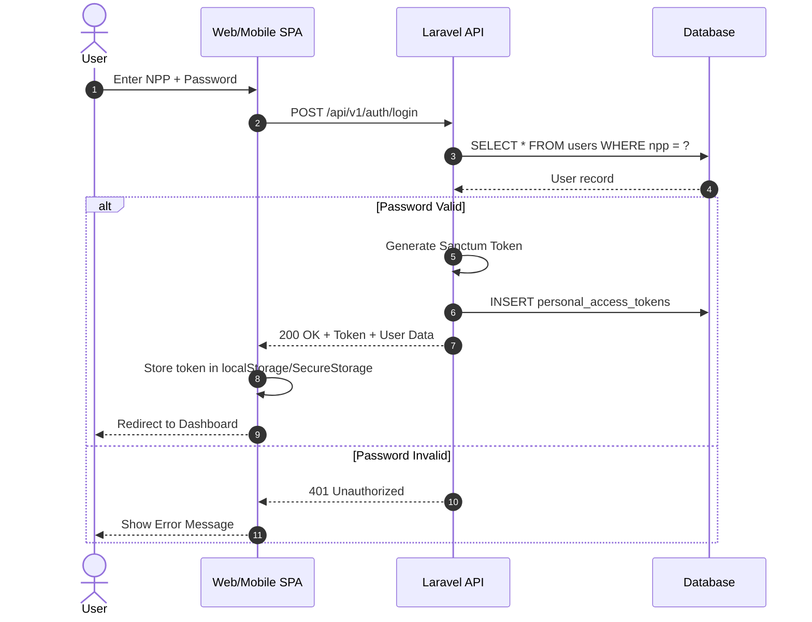
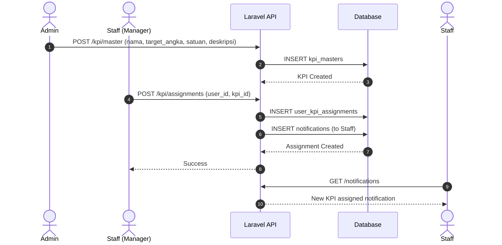
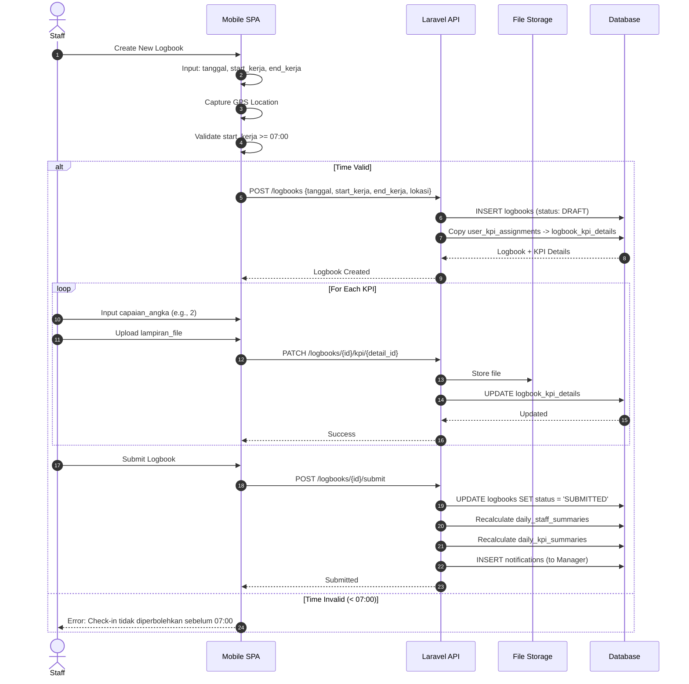
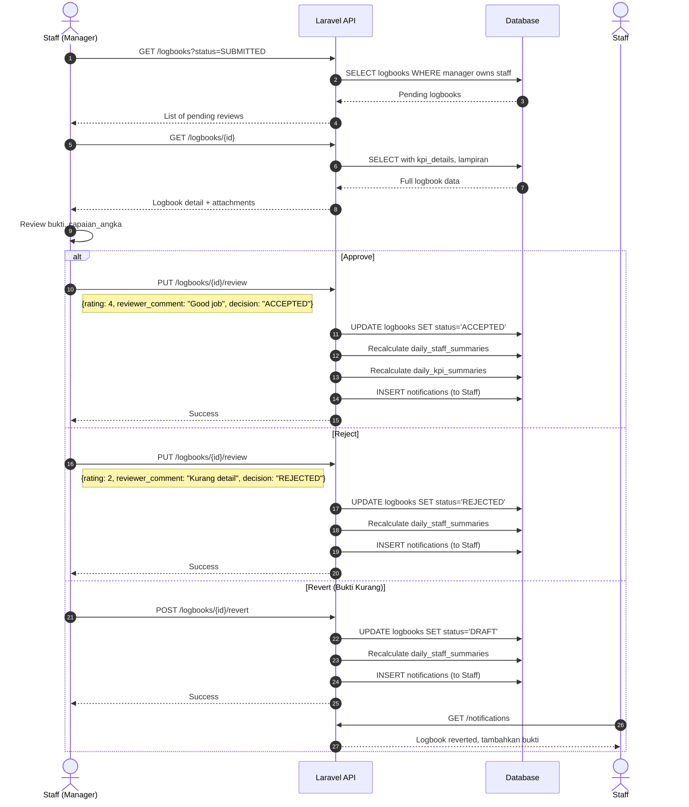

# Data Flow & Business Logic

## 1. System Data Flow Overview

```
                              DATA FLOW DIAGRAM
                              
+----------------+     +----------------+     +----------------+     +----------------+
|   Web Admin    |     |  Mobile SPA    |     |   Laravel      |     |  PostgreSQL    |
|  (SvelteKit)   |     | (Staff Web)    |     |     API        |     |   Database     |
+-------+--------+     +-------+--------+     +-------+--------+     +-------+--------+
        |                      |                      |                      |
        |  HTTP Request        |  HTTP Request        |                      |
        +--------------------->+--------------------->|                      |
        |                      |                      |                      |
        |                      |                      |  SQL Query           |
        |                      |                      +--------------------->|
        |                      |                      |                      |
        |                      |                      |  Result Set          |
        |                      |                      |<---------------------+
        |                      |                      |                      |
        |  JSON Response       |  JSON Response       |                      |
        |<---------------------+<---------------------+                      |
        |                      |                      |                      |
```

---

## 2. Authentication Flow

### 2.1 Login Flow



### 2.2 Authorization Matrix

| Role | Web Admin Access | Mobile SPA Access | Manager Capability |
|------|------------------|-------------------|-------------------|
| SuperAdmin | Full | N/A | N/A |
| Admin | Full (except SuperAdmin features) | N/A | N/A |
| Staff | N/A | Full (Dashboard Tabs) | Based on `manager_id` relation |

### 2.3 Manager Capability Detection

```php
// Pseudo-code untuk menentukan manager capability
function hasManagerCapability(User $user): bool
{
    // Staff yang memiliki bawahan = Manager capability
    return User::where('manager_id', $user->id)
               ->whereNull('deleted_at')
               ->exists();
}
```

---

## 3. Logbook Lifecycle (State Machine)

### 3.1 State Diagram

```
                    +---------------+
                    |     START     |
                    +-------+-------+
                            |
                            | Staff creates logbook (manual time input)
                            v
                    +---------------+
           +------->|     DRAFT     |<-------+
           |        +-------+-------+        |
           |                |                |
           |                | Staff Submit   |
           |                v                |
           |        +---------------+        |
           |        |   SUBMITTED   |        |
           |        +-------+-------+        |
           |                |                |
           |    Manager     |                | Manager Revert
           |    Reject      |                |
           |        +-------+-------+        |
           |        |               |        |
           |        v               v        |
    +------+----------+     +---------------+--+
    |     REJECTED    |     |      ACCEPTED    |
    +-----------------+     +------------------+
           |                         |
           | Staff dapat             | Final State
           | memperbaiki             |
           +-------------------------+-------> END
```

### 3.2 State Transitions

| From | To | Triggered By | Conditions |
|------|----|--------------|------------|
| - | DRAFT | Staff | Manual input: tanggal, start_kerja, end_kerja, lokasi |
| DRAFT | SUBMITTED | Staff | Submit logbook |
| SUBMITTED | DRAFT | Manager | Revert (bukti kurang) |
| SUBMITTED | ACCEPTED | Manager | Rating + Comment + Approve |
| SUBMITTED | REJECTED | Manager | Rating + Comment + Reject |
| REJECTED | DRAFT | Staff | Re-work logbook |

### 3.3 State-Based Access Control

```typescript
// Apa yang bisa dilakukan di setiap state
interface StatePermissions {
  DRAFT: {
    staff: ['edit_kpi', 'upload_attachment', 'submit', 'edit_time'],
    manager: ['view_only']
  },
  SUBMITTED: {
    staff: ['view_only'],
    manager: ['accept', 'reject', 'revert']
  },
  ACCEPTED: {
    staff: ['view_only'],
    manager: ['view_only']
  },
  REJECTED: {
    staff: ['edit_kpi', 'upload_attachment', 'submit', 'edit_time'],
    manager: ['view_only']
  }
}
```

---

## 4. KPI Progress Flow

### 4.1 KPI Assignment Flow



### 4.2 KPI Progress Input Flow (Manual Time)



### 4.3 KPI Detail Data Structure

```json
{
  "logbook_kpi_details": {
    "id": "uuid",
    "logbook_id": "uuid",
    "kpi_id": "uuid",
    "kpi_nama": "Buat Laporan Bulanan",
    "target_angka": 3,
    "satuan": "dokumen",
    "capaian_angka": 2,
    "lampiran_file": [
      "/storage/proofs/2026/03/file1.pdf",
      "/storage/proofs/2026/03/file2.jpg"
    ],
    "finished_at": null,
    "created_at": "2026-03-20T08:00:00Z"
  }
}
```

---

## 5. Review & Approval Flow

### 5.1 Manager Review Flow



---

## 6. Summary Aggregation Flow (NEW)

### 6.1 Pre-Aggregated Summary Tables

```
+-------------------+          +----------------------+
|     logbooks      |          | logbook_kpi_details  |
+-------------------+          +----------------------+
         |                              |
         |  Laravel Event Listener      |
         |  (LogbookObserver)           |
         v                              v
+------------------------+    +------------------------+
| daily_staff_summaries  |    |  daily_kpi_summaries   |
+------------------------+    +------------------------+
| - user_id              |    | - user_id              |
| - date                 |    | - date                 |
| - total_work_minutes   |    | - kpi_id               |
| - logbook_count        |    | - kpi_nama             |
| - accepted_count       |    | - total_achieved       |
| - rejected_count       |    | - total_target         |
| - pending_count        |    | - percentage           |
| - avg_rating           |    +------------------------+
| - total_kpi_achieved   |
| - total_kpi_target     |
| - overall_kpi_percentage|
+------------------------+
```

### 6.2 Summary Recalculation Service

```php
// app/Services/DailySummaryService.php
class DailySummaryService
{
    public static function recalculate(string $userId, string $date): void
    {
        // 1. Get all logbooks for user on date
        $logbooks = Logbook::where('user_id', $userId)
            ->where('tanggal', $date)
            ->whereNull('deleted_at')
            ->with('kpiDetails')
            ->get();

        // 2. Calculate staff summary
        $summary = [
            'total_work_minutes' => $logbooks->sum(fn($l) => $l->effective_minutes),
            'logbook_count' => $logbooks->count(),
            'accepted_count' => $logbooks->where('status', 'ACCEPTED')->count(),
            'rejected_count' => $logbooks->where('status', 'REJECTED')->count(),
            'pending_count' => $logbooks->where('status', 'SUBMITTED')->count(),
            'avg_rating' => $logbooks->whereNotNull('rating')->avg('rating'),
        ];

        // 3. Calculate KPI totals
        $kpiTotals = [];
        foreach ($logbooks as $logbook) {
            foreach ($logbook->kpiDetails as $detail) {
                if (!isset($kpiTotals[$detail->kpi_id])) {
                    $kpiTotals[$detail->kpi_id] = [
                        'achieved' => 0,
                        'target' => 0,
                        'kpi_nama' => $detail->kpi_nama,
                    ];
                }
                $kpiTotals[$detail->kpi_id]['achieved'] += $detail->capaian_angka;
                $kpiTotals[$detail->kpi_id]['target'] += $detail->target_angka;
            }
        }

        $totalAchieved = array_sum(array_column($kpiTotals, 'achieved'));
        $totalTarget = array_sum(array_column($kpiTotals, 'target'));
        
        $summary['total_kpi_achieved'] = $totalAchieved;
        $summary['total_kpi_target'] = $totalTarget;
        $summary['overall_kpi_percentage'] = $totalTarget > 0 
            ? ($totalAchieved / $totalTarget) * 100 
            : 0;

        // 4. Upsert daily_staff_summaries
        DailyStaffSummary::updateOrCreate(
            ['user_id' => $userId, 'date' => $date],
            $summary
        );

        // 5. Upsert daily_kpi_summaries
        foreach ($kpiTotals as $kpiId => $kpi) {
            DailyKpiSummary::updateOrCreate(
                ['user_id' => $userId, 'date' => $date, 'kpi_id' => $kpiId],
                [
                    'kpi_nama' => $kpi['kpi_nama'],
                    'total_achieved' => $kpi['achieved'],
                    'total_target' => $kpi['target'],
                    'percentage' => $kpi['target'] > 0 
                        ? ($kpi['achieved'] / $kpi['target']) * 100 
                        : 0,
                ]
            );
        }
    }
}
```

### 6.3 Event Listener (LogbookObserver)

```php
// app/Observers/LogbookObserver.php
class LogbookObserver
{
    public function created(Logbook $logbook): void
    {
        $this->recalculate($logbook);
    }

    public function updated(Logbook $logbook): void
    {
        // Recalculate when status or rating changes
        if ($logbook->wasChanged(['status', 'rating', 'tanggal'])) {
            $this->recalculate($logbook);
            
            // If date changed, also recalculate old date
            if ($logbook->wasChanged('tanggal')) {
                DailySummaryService::recalculate(
                    $logbook->user_id,
                    $logbook->getOriginal('tanggal')
                );
            }
        }
    }

    public function deleted(Logbook $logbook): void
    {
        $this->recalculate($logbook);
    }

    private function recalculate(Logbook $logbook): void
    {
        DailySummaryService::recalculate(
            $logbook->user_id,
            $logbook->tanggal
        );
    }
}
```

---

## 7. Work Duration Calculation

### 7.1 Break Time Logic

```sql
-- Business Rule:
-- Jam istirahat: 12:00 - 13:00 (1 jam)
-- Jika shift overlap dengan periode ini, kurangi dari total durasi

-- Example Scenarios:
-- Shift 08:00 - 17:00 -> Break 60 min -> Effective: 8 hours
-- Shift 08:00 - 12:30 -> Break 30 min -> Effective: 4 hours
-- Shift 13:30 - 17:00 -> Break 0 min -> Effective: 3.5 hours
-- Shift 10:00 - 11:00 -> Break 0 min -> Effective: 1 hour
```

### 7.2 Database View

```sql
CREATE OR REPLACE VIEW v_logbook_work_duration AS
SELECT 
    l.id AS logbook_id,
    l.user_id,
    l.tanggal,
    l.start_kerja,
    l.end_kerja,
    l.status,
    
    -- Raw duration in minutes (TIME fields)
    EXTRACT(EPOCH FROM (l.end_kerja - l.start_kerja)) / 60 AS total_minutes,
    
    -- Break time calculation (12:00-13:00 overlap)
    CASE 
        WHEN l.end_kerja IS NULL THEN 0
        ELSE
            GREATEST(0, 
                LEAST(
                    EXTRACT(EPOCH FROM (
                        LEAST(l.end_kerja, '13:00'::time) -
                        GREATEST(l.start_kerja, '12:00'::time)
                    )) / 60,
                    60
                )
            )
    END AS break_minutes,
    
    -- Effective work duration
    CASE 
        WHEN l.end_kerja IS NULL THEN NULL
        ELSE 
            (EXTRACT(EPOCH FROM (l.end_kerja - l.start_kerja)) / 60) -
            GREATEST(0, 
                LEAST(
                    EXTRACT(EPOCH FROM (
                        LEAST(l.end_kerja, '13:00'::time) -
                        GREATEST(l.start_kerja, '12:00'::time)
                    )) / 60,
                    60
                )
            )
    END AS effective_work_minutes
    
FROM logbooks l
WHERE l.deleted_at IS NULL;
```

---

## 8. Notification Flow

### 8.1 Notification Types

| Type | Trigger | Recipient | Message Template |
|------|---------|-----------|------------------|
| `KPI_ASSIGNMENT` | Manager assigns KPI | Staff | "KPI baru telah ditugaskan: {kpi_nama}" |
| `LOGBOOK_SUBMITTED` | Staff submits logbook | Manager | "{staff_name} telah mensubmit logbook" |
| `LOGBOOK_ACCEPTED` | Manager accepts | Staff | "Logbook Anda telah diterima (Rating: {rating}/5)" |
| `LOGBOOK_REJECTED` | Manager rejects | Staff | "Logbook Anda ditolak: {comment}" |
| `LOGBOOK_REVERTED` | Manager reverts | Staff | "Logbook Anda dikembalikan untuk perbaikan" |

### 8.2 Notification Data Structure

```json
{
  "id": "uuid",
  "user_id": "uuid",
  "title": "Logbook Diterima",
  "message": "Logbook Anda tanggal 20 Maret 2026 telah diterima dengan rating 4/5",
  "type": "LOGBOOK_ACCEPTED",
  "reference_id": "logbook_uuid",
  "is_read": false,
  "created_at": "2026-03-20T17:00:00Z"
}
```

---

## 9. File Upload Logic

### 9.1 Attachment Per KPI

```
OLD Structure (Current):
logbooks
+-- gambar_bukti: ["file1.jpg", "file2.jpg"]  <- All files in one array

NEW Structure (Target):
logbook_kpi_details
+-- KPI 1: lampiran_file: ["kpi1_bukti1.jpg", "kpi1_bukti2.pdf"]
+-- KPI 2: lampiran_file: ["kpi2_bukti1.jpg"]
+-- KPI 3: lampiran_file: []
```

### 9.2 File Upload API

```
POST /logbooks/{id}/kpi/{detail_id}/attachments

Request:
- Content-Type: multipart/form-data
- file: binary (max 5MB, types: jpg, png, pdf, doc, docx)

Response:
{
  "file_url": "/storage/proofs/2026/03/20/abc123.jpg",
  "file_name": "bukti_laporan.jpg",
  "file_size": 245678,
  "uploaded_at": "2026-03-20T10:30:00Z"
}
```

---

## 10. Business Rules Summary

| Rule | Description | Implementation |
|------|-------------|----------------|
| BR-01 | Check-in >= 07:00 | Backend validation + Frontend disable |
| BR-02 | Break 12:00-13:00 auto-deduct | Database View calculation |
| BR-03 | KPI progress numeric | `capaian_angka` decimal field |
| BR-04 | Attachment per KPI | `lampiran_file` in logbook_kpi_details |
| BR-05 | Review requires comment | `reviewer_comment` mandatory |
| BR-06 | Manager by relation | Check `manager_id` not role enum |
| BR-07 | Single GPS location | One `lokasi` field at logbook creation |
| BR-08 | Soft delete all records | `deleted_at` timestamp |
| BR-09 | Manual time input | `tanggal` (DATE) + `start_kerja` (TIME) + `end_kerja` (TIME) |
| BR-10 | Multiple logbooks per day | No unique constraint on user_id + tanggal |
| BR-11 | Pre-aggregated summaries | daily_staff_summaries + daily_kpi_summaries tables |
| BR-12 | Summary recalculation | Laravel Event Listeners (LogbookObserver) |

---

## 11. Error Handling

### 11.1 Standard Error Response

```json
{
  "message": "Validation failed",
  "errors": {
    "field_name": ["Error message 1", "Error message 2"]
  }
}
```

### 11.2 Error Codes

| HTTP Code | Meaning | Example |
|-----------|---------|---------|
| 400 | Bad Request | Invalid status transition |
| 401 | Unauthorized | Invalid/expired token |
| 403 | Forbidden | Not owner/manager of resource |
| 404 | Not Found | Resource doesn't exist |
| 422 | Validation Error | Missing required fields |
| 500 | Server Error | Database connection failed |

---

**Next Document**: `02-WEB-ADMIN-PAGES.md` - Halaman web untuk SuperAdmin & Admin
