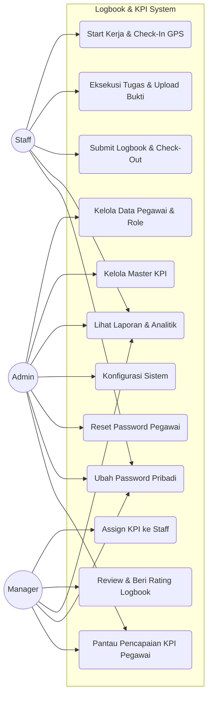
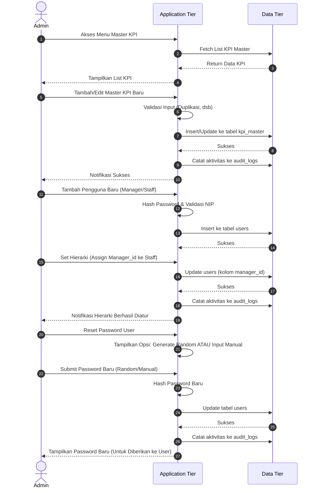
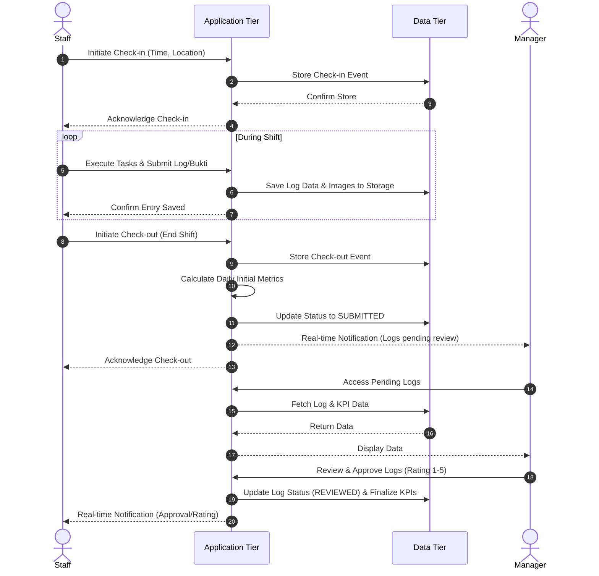
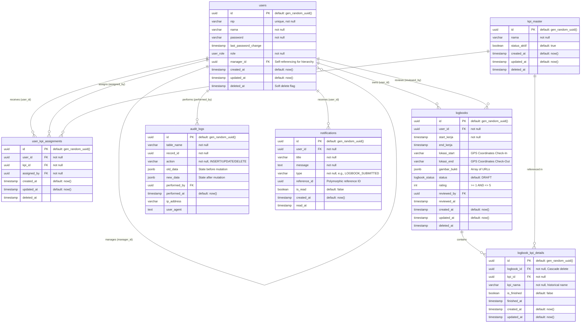
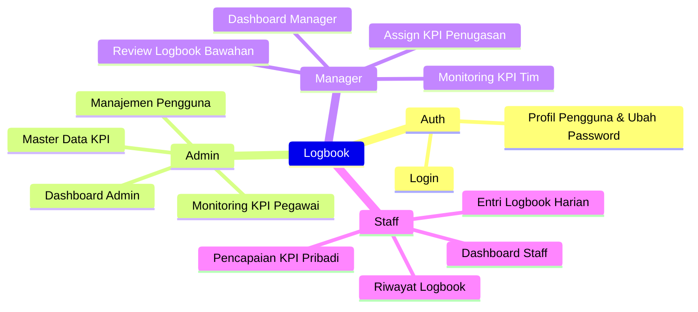
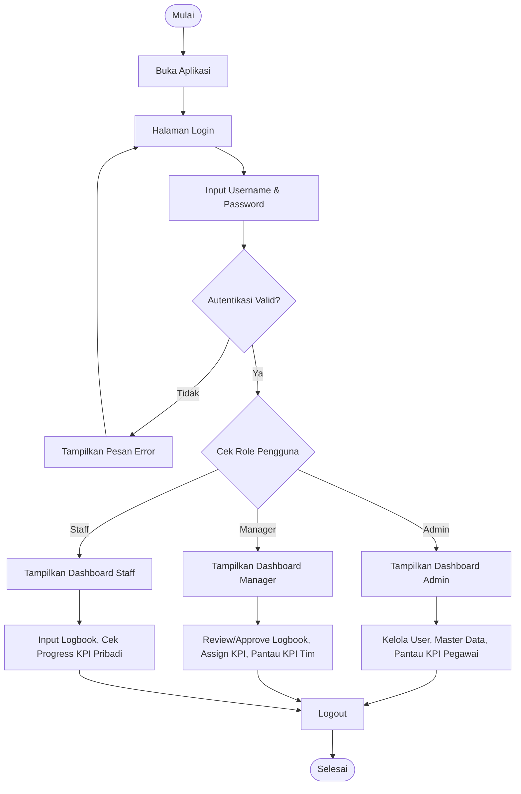

# SYSTEM DESIGN DOCUMENT: Aplikasi Manajemen Logbook & KPI Pegawai

## 1. Pendahuluan

Aplikasi ini dirancang untuk mendigitalisasi pelaporan kerja harian (Logbook) dan manajemen Key Performance Indicator (KPI) atau tugas karyawan. Sistem ini memastikan transparansi tugas yang diberikan oleh manajer, memfasilitasi pencatatan waktu dan lokasi, serta mengelola siklus hidup data untuk keperluan audit dan penilaian kinerja yang akurat.

**Improvements:**

- Mengadopsi arsitektur terukur dengan **Caching** dan **Asynchronous Processing**.
- Mendukung fitur offline-first melalui arsitektur PWA (Progressive Web App).
- Menambahkan kapabilitas Notifikasi dan Audit Logging yang komprehensif.

---

## 2. Arsitektur Sistem

Arsitektur dibagi menjadi 3 tier utama (Client, Application, dan Data Tier) untuk memastikan skalabilitas, keamanan data, dan pemisahan logika (separation of concerns).

```mermaid
graph TD
    subgraph "Client Tier (Presentation)"
        A[Web Browser (Staff)]
        B[Web Browser (Atasan)]
        C[Web Browser (Super Admin)]
    end

    subgraph "Application Tier (Logic)"
        D[Load Balancer / Nginx]
        E[API Server (Backend)]
        F[Authentication Service (JWT)]
        G[Business Logic & Hierarchy Handler]
    end

    subgraph "Data Tier (Storage)"
        H[(Primary Database - PostgreSQL)]
        I[File Storage (Lampiran Log)]
        J[Cache Server (Redis)]
    end

    A --> D
    B --> D
    C --> D
    D --> E
    E --> F
    E --> G
    G --> H
    G --> I
    E --> J
```

---

## 3. Aktor & Hak Akses (Role-Based Access Control)

1. **Admin / Super Admin**: Mengelola master data (Pegawai, Master KPI, dan Konfigurasi Sistem). Tidak berpartisipasi dalam alur operasional harian.
2. **Manager / Atasan**: Atasan langsung dari Staff. Bertugas menetapkan KPI spesifik ke Staff, me-review logbook harian, dan memberikan _Rating_ (1-5).
3. **Staff**: Pengguna akhir operasional. Memulai hari kerja, melihat daftar tugas otomatis, mencentang (toggle) tugas selesai, mengunggah bukti, dan mengakhiri hari kerja.

### Use Case Diagram



---

## 4. Fitur Utama & Alur Kerja (Core Workflows)

### A. Alur Pengelolaan Master Data & Hierarki (Admin)



### B. Alur Penugasan KPI (Manager & Admin)

1. Admin membuat daftar "Master KPI" (Kamus Tugas).
2. Manager membuka profil Staff bawahannya, lalu menetapkan (assign) satu atau lebih KPI dari Master KPI.
3. Daftar tugas ini menjadi status "Aktif" untuk Staff tersebut dan akan disalin secara otomatis setiap kali Staff memulai logbook.

### C. Alur Logbook Harian (Staff & Manager)



---

## 5. Logbook State Machine (Siklus Hidup Logbook)

Untuk mencegah perubahan data yang tidak sah (misal: mengedit foto setelah dinilai) dan menangani kesalahan _user_ (misal: tidak sengaja klik selesai), Logbook menggunakan sistem _State Machine_ dengan 3 status utama:

- **`DRAFT` (Sedang Berjalan)**
  - **Pemicu:** Terbentuk saat Staff klik "Start Kerja".
  - **Akses:** Staff dapat mengedit (mencentang tugas, membatalkan centang, menambah/menghapus foto bukti). Manager hanya bisa melihat status "Sedang Bekerja" tapi belum bisa menilai.
- **`SUBMITTED` (Menunggu Review)**
  - **Pemicu:** Berubah saat Staff klik "End Kerja" atau Submit Logbook.
  - **Akses:** Data **terkunci (Locked)** untuk Staff. Staff tidak dapat lagi mengubah tugas atau foto. Manager sekarang dapat mereview bukti, waktu, dan rasio penyelesaian tugas.
  - _(Opsional: Manager dapat menekan tombol "Revert/Kembalikan" mengubah status kembali ke `DRAFT` jika bukti kurang)._
- **`REVIEWED` (Selesai & Dinilai)**
  - **Pemicu:** Berubah saat Manager memberikan _Rating_ (1-5) dan menekan "Simpan Penilaian".
  - **Akses:** Data **terkunci permanen** untuk semua pihak. Menjadi data historis yang valid untuk perhitungan gaji/insentif/kinerja bulanan.

---

## 6. Desain Basis Data (DBML & Schema)

Desain sistem memanfaatkan PostgreSQL. Untuk menjaga integritas data historis (Audit Trail), sistem mengimplementasikan **Soft Deletes**. Desain skema ini telah ditingkatkan dengan tabel `audit_logs` untuk pelacakan mutasi dan `notifications` untuk komunikasi asinkron.



---

## 7. Arsitektur API (RESTful Endpoints & Websockets)

Berikut adalah desain API Route yang komprehensif, dipecah berdasarkan Domain/Controller dengan standar penamaan RESTful.
Base URL: `/api/v1`

### 1. Authentication & Profile (Auth Controller)

Menangani autentikasi, manajemen sesi, dan profil pribadi pengguna.
| Method | Endpoint | Roles | Description |
| :--- | :--- | :--- | :--- |
| `POST` | `/auth/login` | Public | Autentikasi user, kembalikan JWT |
| `POST` | `/auth/logout` | All | Invalidate token saat ini |
| `GET` | `/auth/me` | All | Ambil data profil user yang login |
| `PUT` | `/auth/change-password` | All | User ubah password mereka sendiri. Validasi _old password_ & update _new password_. |

### 2. User & Keamanan Management (Users Controller)

Dikelola oleh Admin untuk CRUD data pegawai dan hierarki.
| Method | Endpoint | Roles | Description |
| :--- | :--- | :--- | :--- |
| `GET` | `/users` | Admin, Manager | List pegawai (Manager hanya lihat bawahannya) |
| `POST` | `/users` | Admin | Buat user baru (Manager/Staff) |
| `GET` | `/users/{id}` | Admin, Manager | Ambil detail spesifik user (Manager hanya bisa akses bawahannya) |
| `PUT` | `/users/{id}` | Admin | Update role, NIP, nama, atau `manager_id` |
| `PUT` | `/users/{id}/reset-password` | Admin | Reset password pegawai ke password manual/random baru. |
| `DELETE` | `/users/{id}` | Admin | Hapus data pegawai (Soft delete) |

### 3. Master KPI Management (Master KPI Controller)

Kamus tugas/KPI di tingkat instansi.
| Method | Endpoint | Roles | Description |
| :--- | :--- | :--- | :--- |
| `GET` | `/kpi/master` | Admin, Manager | List Master KPI (Filter `deleted_at IS NULL`) |
| `POST` | `/kpi/master` | Admin | Tambah Master KPI baru |
| `PUT` | `/kpi/master/{id}` | Admin | Update detail nama/status Master KPI |
| `DELETE` | `/kpi/master/{id}` | Admin | Hapus Master KPI (Soft delete) |

### 4. KPI Assignments (KPI Assignment Controller)

Distribusi tugas Master KPI ke Pegawai secara spesifik.
| Method | Endpoint | Roles | Description |
| :--- | :--- | :--- | :--- |
| `GET` | `/kpi/assignments` | Admin, Manager | List tugas yang sudah di-assign (Manager: untuk bawahan; Admin: bisa semua pegawai) |
| `POST` | `/kpi/assignments` | Manager | Assign KPI spesifik ke Staff (Memicu Notifikasi) |
| `DELETE` | `/kpi/assignments/{id}` | Manager | Cabut penugasan KPI dari Staff |
| `GET` | `/kpi/me` | Staff | Staff melihat daftar tugas yang menjadi tanggung jawabnya |

### 5. Logbook Operations (Logbook Controller)

_State Machine_ (`DRAFT` -> `SUBMITTED` -> `REVIEWED`) diimplementasikan di sini.
| Method | Endpoint | Roles | Description |
| :--- | :--- | :--- | :--- |
| `POST` | `/logbooks/start` | Staff | Mulai kerja (Check-in GPS). Buat `logbooks` `DRAFT`, salin `user_kpi_assignments` ke `logbook_kpi_details`. |
| `GET` | `/logbooks` | Admin, Manager, Staff | List logbook harian. Staff lihat miliknya, Manager lihat timnya, Admin lihat semua. |
| `GET` | `/logbooks/{id}` | Admin, Manager, Staff | Detail logbook & list KPI hari itu. |
| `PATCH` | `/logbooks/{id}/kpi/{detail_id}/toggle` | Staff | Centang/batal tugas selesai. Hanya bisa jika status `DRAFT`. |
| `POST` | `/logbooks/{id}/submit` | Staff | Akhiri shift (Check-out GPS, upload `gambar_bukti`). Ubah ke `SUBMITTED`. Picu Notif Manager. |
| `POST` | `/logbooks/{id}/revert` | Manager | Mengembalikan logbook `SUBMITTED` menjadi `DRAFT` jika bukti/laporan dirasa kurang. |
| `PUT` | `/logbooks/{id}/rate` | Manager | Beri rating (1-5). Ubah status ke `REVIEWED`. Picu Notif ke Staff. |

### 6. Dashboards & Reports (Analytics Controller)

Endpoint yang dioptimasi (dengan _Redis Cache_) untuk UI Dasbor.
| Method | Endpoint | Roles | Description |
| :--- | :--- | :--- | :--- |
| `GET` | `/dashboard/admin` | Admin | Statistik sistem: total user aktif, logs bulan ini |
| `GET` | `/dashboard/manager` | Manager | Performa KPI bawahan, list logbook pending review |
| `GET` | `/dashboard/staff` | Staff | Rasio penyelesaian tugas pribadi, logbook yang terlewat |
| `GET` | `/users/{id}/kpi-achievements` | Admin, Manager | Melihat detail pencapaian KPI spesifik milik seorang pegawai. Admin melihat semua, Manager hanya bawahannya. |
| `GET` | `/reports/export` | Admin, Manager| Ekspor rekapitulasi ke CSV / PDF |

### 7. System & Notifications (Notification & Audit Controller)

| Method | Endpoint                   | Roles | Description                                                                      |
| :----- | :------------------------- | :---- | :------------------------------------------------------------------------------- |
| `GET`  | `/notifications`           | All   | Ambil list notifikasi user                                                       |
| `PUT`  | `/notifications/{id}/read` | All   | Tandai notif spesifik sudah dibaca                                               |
| `PUT`  | `/notifications/read-all`  | All   | Tandai semua notif sudah dibaca                                                  |
| `GET`  | `/audit-logs`              | Admin | Menampilkan riwayat aktivitas sistem (untuk Dashboard Admin & Security Auditing) |

---

## 8. User Interface

### A. Diagram Navigasi (Sitemap)



### B. App Flowchart (Perjalanan Pengguna)



### C. Daftar Halaman / Layar (Screen Breakdown)

#### 1. Umum (General)

- **Halaman Login**
  - **Deskripsi/Tujuan**: Pintu masuk utama aplikasi untuk autentikasi pengguna.
  - **Data yang Ditampilkan**: Logo instansi, Form NIP/Username, Form Password.
  - **Aksi**: Tombol `Login`.
- **Profil Pengguna (User Profile)**
  - **Deskripsi/Tujuan**: Menampilkan dan memperbarui informasi dasar pengguna yang sedang login.
  - **Data yang Ditampilkan**: Foto profil, Nama Lengkap, Jabatan, NIP, Waktu Terakhir Ubah Password (Last Password Change).
  - **Aksi**: `Edit Profil`, `Ubah Password`, `Simpan Perubahan`, `Logout`.

#### 2. Admin

- **Dashboard Admin**
  - **Deskripsi/Tujuan**: Halaman beranda Admin untuk melihat ringkasan aktivitas sistem secara keseluruhan.
  - **Data yang Ditampilkan**: Total Pengguna Aktif, Total Log Book, Log Aktivitas Sistem (Audit Logs) terbaru.
  - **Aksi**: Navigasi cepat ke menu `Manajemen Pengguna`, `Master Data`, dan `Monitoring KPI Pegawai`.
- **Manajemen Pengguna (User Management)**
  - **Deskripsi/Tujuan**: Mengelola akses, akun, dan hierarki karyawan di dalam sistem.
  - **Data yang Ditampilkan**: Tabel daftar pengguna (Nama, NIP, Role, Manager, Status).
  - **Aksi**: `Tambah Pengguna Baru`, `Edit Data Pengguna`, `Set Atasan (Manager_id)`, `Reset Password`.
- **Master Data KPI**
  - **Deskripsi/Tujuan**: Mengelola indikator KPI yang berlaku untuk instansi.
  - **Data yang Ditampilkan**: Tabel daftar KPI (Nama Indikator, Status Aktif, Tanggal Dibuat).
  - **Aksi**: `Tambah KPI Baru`, `Edit KPI`, `Hapus KPI (Soft Delete)`.
- **Monitoring KPI Pegawai (Global KPI Monitoring)**
  - **Deskripsi/Tujuan**: Memantau performa dan pencapaian KPI dari seluruh pegawai di instansi.
  - **Data yang Ditampilkan**: Daftar seluruh staff dengan persentase capaian KPI, Filter berdasarkan periode atau departemen/Manager.
  - **Aksi**: `Lihat Detail Logbook Pegawai`, `Ekspor Laporan Keseluruhan`.

#### 3. Manager

- **Dashboard Manager**
  - **Deskripsi/Tujuan**: Memberikan gambaran ringkas mengenai performa tim dan tugas yang butuh persetujuan harian.
  - **Data yang Ditampilkan**: Jumlah logbook yang menunggu direview (SUBMITTED), Rata-rata pencapaian KPI Tim saat ini, Daftar anggota tim.
  - **Aksi**: Pintasan ke menu `Review Logbook`, Pintasan ke halaman `Monitoring KPI Tim` (untuk melihat rincian progres tiap bawahan).
- **Monitoring KPI Tim (Team KPI Monitoring)**
  - **Deskripsi/Tujuan**: Memantau performa dan rincian pencapaian individu KPI dari setiap anggota tim/bawahan secara spesifik.
  - **Data yang Ditampilkan**: Daftar bawahan dengan persentase capaian KPI harian/bulanan.
  - **Aksi**: `Lihat Detail KPI & Logbook Bawahan`, `Ekspor Laporan Tim`.
- **Assign KPI ke Staff (KPI Assignment)**
  - **Deskripsi/Tujuan**: Menentukan tugas spesifik apa saja yang harus dikerjakan oleh masing-masing staff dari Master KPI.
  - **Data yang Ditampilkan**: Daftar bawahan, Daftar Master KPI yang tersedia, List KPI yang sudah di-assign.
  - **Aksi**: `Tambah Penugasan`, `Cabut Penugasan`.
- **Persetujuan Logbook (Logbook Approval)**
  - **Deskripsi/Tujuan**: Meninjau dan memberikan rating/penilaian pada logbook yang disubmit staff.
  - **Data yang Ditampilkan**: Daftar logbook SUBMITTED (Nama Staff, Tanggal, Jam Kerja, Daftar Tugas Selesai, Foto/Bukti).
  - **Aksi**: `Review (Beri Rating 1-5)`, `Kembalikan/Revert ke DRAFT`, `Lihat Bukti Foto (Lightbox)`.

#### 4. Staff

- **Dashboard Staff**
  - **Deskripsi/Tujuan**: Beranda operasional harian. Menampilkan ringkasan status kerja dan reminder.
  - **Data yang Ditampilkan**: Persentase pencapaian KPI harian/bulanan, Status logbook hari ini (DRAFT/Belum Mulai), Reminder untuk Check-out jika sedang aktif.
  - **Aksi**: Tombol besar `Start Kerja (Check-In)`.
- **Entri Logbook Harian (Daily Logbook Workspace)**
  - **Deskripsi/Tujuan**: Ruang kerja Staff setelah menekan "Start Kerja". Digunakan sepanjang hari.
  - **Data yang Ditampilkan**: Waktu Start, Lokasi Start (Peta kecil), Daftar tugas/KPI aktif (berupa checklist).
  - **Aksi**: `Centang Tugas (Selesai/Batal)`, `Upload Bukti Foto`, `End Kerja (Check-Out)`.
- **Riwayat Logbook (Logbook History)**
  - **Deskripsi/Tujuan**: Melihat daftar hari kerja yang telah direview maupun masih dalam status SUBMITTED.
  - **Data yang Ditampilkan**: Kalender riwayat (Tanggal, Status, Rating dari Manager).
  - **Aksi**: `Filter Bulan`, `Klik Detail Logbook` (untuk melihat komentar/rating atasan).
- **Pencapaian KPI Pribadi (Personal KPI Dashboard)**
  - **Deskripsi/Tujuan**: Melacak sejauh mana pekerjaan yang dicatat berdampak pada penilaian individu bulanan/tahunan.
  - **Data yang Ditampilkan**: Daftar KPI pribadi dan rasio penyelesaian rata-ratanya berdasarkan akumulasi logbook yang berstatus REVIEWED.
  - **Aksi**: `Filter Periode`.
